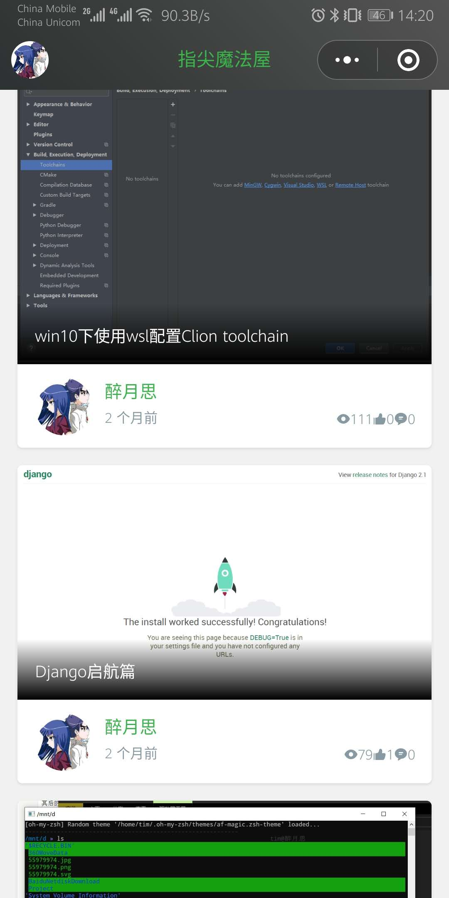
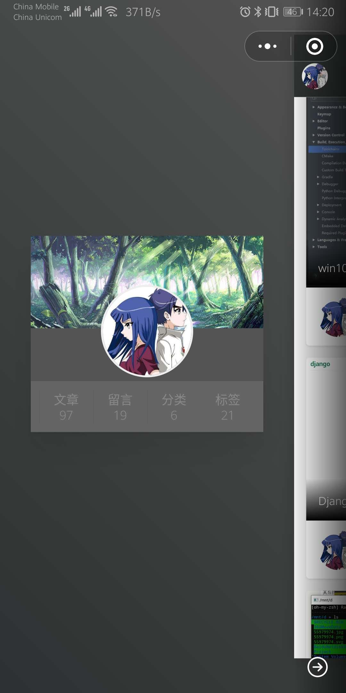
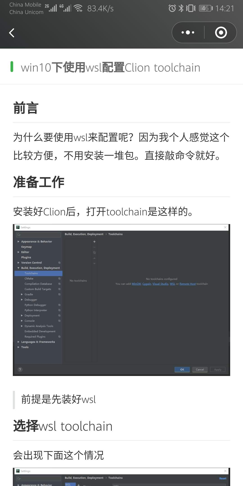

# WeBlog

一个typecho博客的微信小程序版

## 使用方法

### 小程序端

#### 开发框架

本项目采用[uni-app](https://uniapp.dcloud.io/component/README)+[colorUI](https://github.com/weilanwl/ColorUI)开发

## 编译方式

1. 下载Hbuilderx
2. 将文件夹 `uni-app` 导入项目
3. 发行至微信小程序

## 使用方法

1. 自行编译或者打开`unpackage/dist/build/mp-weixin`目录导入小程序开发者工具
2. 激活插件后， 修改请求链接文件 `@/static/utils/api.js` 中的baseUrl, 将域名更换为你的域名。 

> 请确保插件已成功安装并且访问正常

### Typecho插件端

## 使用方法

复制该目录到插件目录， 在后台激活设置

## 开发计划

- [x] 浏览量和点赞量数据表

- [x] 评论功能

- [] 评论回复功能

- [] 评论通知功能

| 主页  |      关于页      |  文章页 |
|:-------------:|:-------------:|:-------------:|
|  |   |  |
